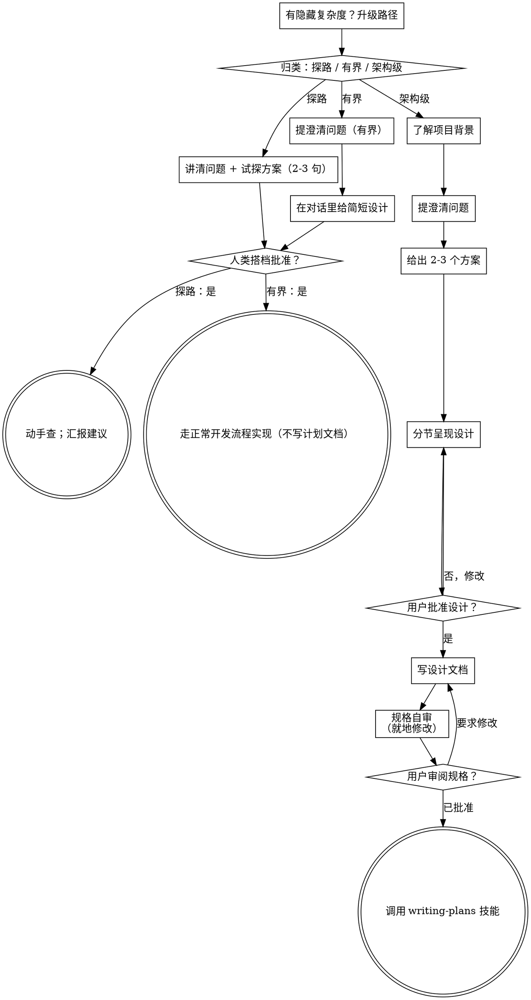

# 把想法打磨成设计方案

通过自然的协作对话，把想法变成完整的设计方案和规格说明。

先判断这个请求需要多重的流程，然后按对应路径推进：理11      解背景、打磨想法、给出设计、拿到人类搭档的批准。

<HARD-GATE>
在你告诉人类搭档自己的打算、并得到对方批准之前，不要调用任何实现类技能、不要写任何代码、不要搭任何项目脚手架、不要采取任何实现动作。下面每条路径上的每一个任务都适用这一条 —— 流程的隆重程度可以随任务大小伸缩，批准这道关卡永远不能省。
</HARD-GATE>

## 三条路径

提出第一个问题之前，先给请求归类，并把自己的判断说出来 —— 比如「这个看起来属于有界改动，我直接在这里给个简短设计，不写规格文档」—— 这样人类搭档可以推翻你的判断：

- **Spike（探路验证）** —— 回答一个可行性问题（“我们能不能……”“有没有可能……”“跑通了就行，不用写好看”），产出的是一个答案，不是你要留下的代码。用 2-3 句话说明要验证的问题和打算怎么试，得到对方点头，然后用最省成本又不失正确的方式去查。不写设计文档，不写规格文件。结果以建议的形式汇报；期间搭出来的任何东西都标注为一次性弃用。
- **Bounded（有界改动）** —— 对本仓库里已经存在的代码做范围明确的修改：加一个开关、加一个小接口、修一个文件。光了解这是哪类应用还不够 —— 有界的意思是你要改的那条流程已经摆在眼前可以读。如果压根没有现成的流程可改，这个任务就不算有界。只问真正要紧的澄清问题，在对话里给一个简短设计（几句话到几段话），然后停下。只有人类搭档对这个设计说了「可以」，才开始实现 —— 有界任务的批准关卡，和架构级任务一样硬。不写规格文件，不写实现计划文档。
- **Architectural（架构级）** —— 新项目、新子系统，或者会重构组件组合方式、改动别人依赖的接口的变更。走完整流程：提问题、列方案、分节设计、写成规格文档，然后调用 writing-plans 技能。

拿不准该走哪条路径时，选更重的那条。这条棘轮只能单向转：任务做到一半发现隐藏的复杂度，就往上调路径 —— 停下来，说明情况，升级处理。任何情况都不许中途降级。

## 反面模式：「太简单，不用批准」

每条路径的终点，都是人类搭档在实现之前批准你的意图。一份待办清单、一个单函数小工具、一处配置改动 —— 设计也许只是对话里的两句话，但你必须把它讲出来并拿到批准。恰恰是「简单」任务里，没被检查过的假设最容易造成大量白费功夫。随简单程度伸缩的是产出物的大小，绝不是那道批准关卡。

## 危险信号

| 念头                                                   | 现实                                                                                     |
| ------------------------------------------------------ | ---------------------------------------------------------------------------------------- |
| 「这个太简单，不用设计」                               | 简单意味着设计可以短，不是不要设计。对话里两句话，然后拿批准。                           |
| 「我就说它是有界改动，把规格省了」                     | 你急着贴标签省活儿，本身就说明心里没底 —— 走更重的那条路。                             |
| 「它是有界改动，设计也明摆着 —— 我边给他们看边动手」 | 关卡在于批准，不在于设计长短。先讲清楚，然后停下，直到听见对方说可以。                   |
| 「这类应用我熟，所以它是有界改动」                     | 有界与否看的是仓库里有没有现成代码，不是看你熟不熟。新项目没有现成流程 —— 它是架构级。 |
| 「探路跑通了，所以代码我就留下了」                     | 探路的产出是一个答案。想把代码留下，就属于新的请求 —— 重新归类。                       |
| 「范围是变大了，但我都快做完了 —— 不用再归类了」     | 隐藏的复杂度会把路径中途升级。停下来，说明情况。                                         |
| 「他们批准了探路，所以后续这个改动也算批准了」         | 每个任务都要单独归类、单独拿批准。                                                       |

## 检查清单

先归类，说出走哪条路径，然后为这条路径上的每一项建一个任务，按顺序完成。

**Spike（探路）：**

1. **了解项目背景** —— 足够把这次试探框定清楚就行
2. **讲清问题和试探方案** —— 2-3 句话
3. **拿批准** —— 点头即可
4. **动手查** —— 在保证正确的前提下尽量省成本
5. **汇报结果** —— 给一个建议；期间搭的任何东西都标注为一次性弃用

**Bounded（有界改动）：**

1. **了解项目背景** —— 看文件、看文档、看最近的提交
2. **提澄清问题** —— 一次一个，只问要紧的
3. **在对话里给简短设计** —— 思路、会动到哪些文件、怎么测试
4. **拿批准** —— 停下，等对方明确说可以；讲完设计紧接着就开工，等于跳过了关卡
5. **实现** —— 走正常的开发流程（照常做 TDD）；不写计划文档

**Architectural（架构级）：**

1. **了解项目背景** —— 看文件、看文档、看最近的提交
2. **在合适时机才提可视化伴侣** —— 不要一上来就提。第一次出现「画出来比讲出来更清楚」的问题时，再单独发一条消息提出；对方同意后，浏览器标签页会自动为你打开。如果始终没出现需要看图的问题，就永远不要提。详见下面的「可视化伴侣」一节。
3. **提澄清问题** —— 一次一个，弄清目的、约束和成功标准
4. **给出 2-3 个方案** —— 说明取舍，并给出你的推荐
5. **呈现设计** —— 按复杂度分节，每讲完一节就拿用户确认
6. **写设计文档** —— 存到 `docs/superpowers/specs/YYYY-MM-DD-<topic>-design.md` 并提交
7. **规格自审** —— 快速自查占位符、自相矛盾、含糊、范围问题（见下文）
8. **用户审阅写好的规格** —— 请用户在继续之前先看一遍规格文件
9. **转入实现** —— 调用 writing-plans 技能来生成实现计划

## 流程图

**终点状态因路径而异。** 架构级：头脑风暴之后你唯一能调用的技能是 writing-plans —— 绝不能是 frontend-design、mcp-builder 或任何其他实现类技能。有界改动：批准之后直接走正常开发流程，不写计划文档。探路：终点是一份汇报出来的建议。

## 具体流程

下面这些小节服务于有界改动和架构级两条路径（探路到「讲清试探方案、拿到点头」就结束）。从 **探索方案** 往后的内容属于架构级路径的深入部分 —— 做有界改动时，了解背景、问几个问题、在对话里给个简短设计，整个流程就走完了。

**理解想法：**

- 先摸清项目现状（文件、文档、最近的提交）
- 问细节之前先评估范围：如果请求里包含多个彼此独立的子系统（比如“做一个平台，要有聊天、文件存储、计费和数据分析”），马上提出来。别把提问浪费在打磨一个本就该拆分的项目细节上。
- 如果项目太大，一份规格装不下，就帮用户拆成若干子项目：哪些部分是独立的、彼此什么关系、按什么顺序做？然后用正常的设计流程给第一个子项目做头脑风暴。每个子项目各走一遍自己的 规格 → 计划 → 实现 循环。
- 范围合适的项目，就一次一个问题地打磨想法
- 尽量用选择题，开放题也可以
- 一条消息只问一个问题 —— 一个话题需要多聊，就拆成几个问题
- 重点弄清：目的、约束、成功标准

**探索方案：**

- 给出 2-3 个不同方案，并说明各自的取舍
- 用聊天的口吻列选项，附上你的推荐和理由
- 先讲你推荐的那个，并解释为什么
- 严格按 YAGNI 办事 —— 每个方案和设计里不必要的功能统统砍掉

**呈现设计：**

- 当你确信自己懂了要做的东西，再呈现设计
- 每节的详略随复杂度而定：简单的话几句带过，细节多的话最多 200-300 字
- 每讲完一节，问一句目前看着对不对
- 要覆盖：架构、组件、数据流、错误处理、测试
- 有讲不通的地方，随时准备回去澄清

**为隔离和清晰而设计：**

- 把系统拆成更小的单元，每个单元只有一个明确的职责，通过定义清晰的接口通信，能被单独理解和测试
- 对每个单元，你都应该能回答：它是做什么的、怎么用、依赖什么
- 别人不读内部实现，能不能明白一个单元在干什么？改了内部实现会不会弄坏使用方？如果不行，边界还得再划。
- 更小、边界更清楚的单元对你干活也更有利 —— 一次能装进上下文里的代码，你推理得更准；文件职责集中时，你的改动也更可靠。文件一旦变得很大，往往说明它管得太多了。

**在已有代码库里改动：**

- 提改动之前先摸清现有结构，沿用已有的写法。
- 如果现有代码里有影响这次工作的问题（比如某个文件已经太大、边界不清、职责纠缠），把针对性的改进一并放进设计里 —— 就像一个好开发者在改代码时顺手把它改好。
- 别提议不相关的重构。把注意力放在当前目标上。

## 设计之后（架构级路径）

**写文档：**

- 把经过验证的设计（规格）写到 `docs/superpowers/specs/YYYY-MM-DD-<topic>-design.md`
  - （用户对规格存放位置有偏好，以用户为准）
- 如果装了 elements-of-style:writing-clearly-and-concisely 技能，就用上
- 把设计文档提交到 git

**规格自审：**
写完规格文档后，换个新鲜的眼光再看一遍：

1. **查占位符：** 有没有“TBD”“TODO”、没写完的章节、含糊的需求？有就改掉。
2. **查内部一致性：** 几节内容之间有没有互相打架？架构和功能描述对不对得上？
3. **查范围：** 这份规格够不够聚焦，能不能撑起一份实现计划？还是需要拆分？
4. **查含糊之处：** 有没有哪条需求能被理解成两种意思？如果有，选一种，写明确。

发现问题就地改掉。不用再走一轮复审 —— 改完继续就行。

**用户审阅关卡：**
规格自审这轮通过后，请用户在继续之前先审一遍写好的规格：

> “规格已写好并提交到 `<path>`。请先看一遍，如果你想在开始写实现计划之前做改动，告诉我。”

等用户回复。如果用户要求改动，就改，然后重跑规格自审这一轮。用户批准之后才能继续。

**实现：**

- 调用 writing-plans 技能，生成详细的实现计划
- 不要调用任何其他技能。writing-plans 就是下一步。

## 可视化伴侣

一个跑在浏览器里的伴侣，用来在头脑风暴时展示草图、示意图和可视化选项。它是一个工具，不是一种模式。接受这个伴侣，只是说遇到适合看图的问题时可以用它；并不代表每个问题都要走浏览器。

**什么时候提（看准时机）：** 不要一上来就提。等到某个问题确实是画出来比讲出来更清楚时再说 —— 是真正的草图、布局、示意图问题，而不只是聊到某个 UI 话题。第一次出现这种情况时，单独发一条消息提出：

> “接下来这部分，我直接画给你看可能更容易 —— 我可以在浏览器标签页里随手做出草图、示意图和对比图。这功能还比较新，也比较费 token。要试试吗？我来帮你打开。”

**这条提议必须单独成一条消息。** 只提这件事 —— 不要夹带澄清问题、小结或其他内容。等用户回复。如果对方接受，就用 `--open` 启动服务器，浏览器会自动打开到第一个页面。如果对方拒绝，就继续纯文字交流，之后不要再提，除非对方自己提起。

**逐个问题做决定：** 即使用户接受了，每一个问题仍要单独判断是用浏览器还是终端。判断标准：**这个问题，用户看一眼会不会比读文字更容易懂？**

- 内容本身就是视觉化的，**用浏览器** —— 草图、线框图、布局对比、架构示意图、并排的视觉设计
- 内容是文字或表格的，**用终端** —— 需求问题、概念选择、取舍清单、A/B/C/D 文字选项、范围决策

聊到 UI 话题的问题，不自动等于视觉问题。“这里的‘个性’指的是什么？”是概念问题 —— 用终端。“哪种向导布局更好？”是视觉问题 —— 用浏览器。

如果对方同意用这个伴侣，继续之前先读详细指南：
`skills/brainstorming/visual-companion.md`
