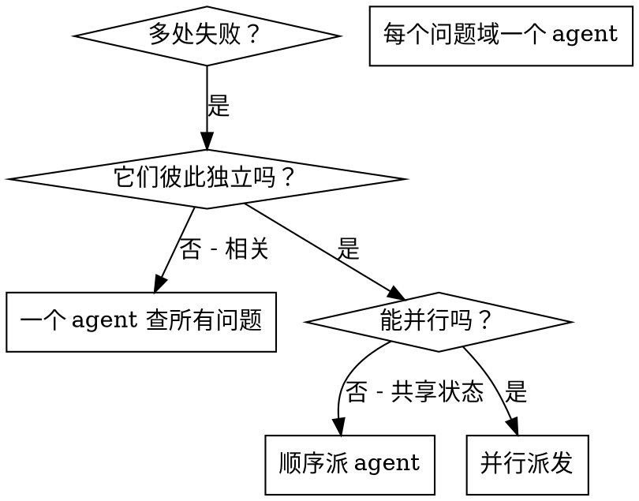

# 并行派发 Agent

## 概述

你把任务交给专门的 agent（代理），它们的上下文相互隔离。只要把指令和上下文准备得精准，它们就能保持专注、把任务干成。它们绝不该继承你所在会话的上下文或历史——它需要什么，由你精确地造出来。这么做也把你自己的上下文省下来做协调。

当你有多处互不相关的故障（不同的测试文件、不同的子系统、不同的 bug），一个一个查就是浪费时间。每处调查彼此独立，可以同时进行。

**核心原则：** 每个独立的问题域派一个 agent。让它们同时干活。

## 何时使用



**适用场景：**
- 3 个以上测试文件失败，且各有不同的根因
- 多个子系统各自独立地坏掉
- 每个问题都能在不了解其他问题上下文的情况下弄懂
- 各次调查之间没有共享状态

**不适用场景：**
- 故障彼此相关（修好一个可能顺带修好别的）
- 需要理解整个系统的状态
- agent 之间会互相干扰

## 模式

### 1. 找出彼此独立的领域

按「坏的是什么」给故障分组：
- File A 的测试：工具审批流程
- File B 的测试：批量完成行为
- File C 的测试：中止功能

每个领域都是独立的——修好工具审批不影响中止测试。

### 2. 设计聚焦的 agent 任务

每个 agent 拿到：
- **具体范围：** 一个测试文件或一个子系统
- **清晰目标：** 让这些测试通过
- **约束：** 不要改动其他代码
- **期望产出：** 你发现了什么、修了什么的摘要

### 3. 并行派发

在同一条回复里发出这三个 subagent 派发——它们会并行运行：

```text
Subagent (general-purpose): "修复 agent-tool-abort.test.ts 的失败"
Subagent (general-purpose): "修复 batch-completion-behavior.test.ts 的失败"
Subagent (general-purpose): "修复 tool-approval-race-conditions.test.ts 的失败"
# 三个同时跑。
```

一条回复里多次派发调用 = 并行执行。一条回复一次 = 顺序执行。

### 4. 审查并整合

agent 返回后：
- 读每份摘要
- 核实各修复之间不冲突
- 跑完整测试套件
- 整合所有改动

## Agent 提示词的结构

好的 agent 提示词是：
1. **聚焦** —— 一个清晰的问题域
2. **自包含** —— 备齐理解问题所需的全部上下文
3. **对产出有明确要求** —— agent 该返回什么？

```markdown
修复 src/agents/agent-tool-abort.test.ts 里 3 个失败的测试：

1. "should abort tool with partial output capture" —— 期望消息里含 'interrupted at'
2. "should handle mixed completed and aborted tools" —— 快工具被中止而非完成
3. "should properly track pendingToolCount" —— 期望 3 个结果却拿到 0

这些是时序/竞态问题。你的任务：

1. 读测试文件，弄懂每个测试在验证什么
2. 找出根因 —— 是时序问题还是真 bug？
3. 修复方式：
   - 用基于事件的等待替换掉随意的超时
   - 若发现中止实现里有 bug，就修掉
   - 若是在测试已改变的行为，就调整测试预期

不要只是把超时调大——找出真正的问题。

返回：你发现了什么、修了什么的摘要。
```

## 常见错误

**❌ 太宽泛：** 「修复所有测试」—— agent 会迷路
**✅ 具体：** 「修复 agent-tool-abort.test.ts」—— 范围聚焦

**❌ 没有上下文：** 「修复这个竞态问题」—— agent 不知道在哪
**✅ 有上下文：** 把错误消息和测试名贴进去

**❌ 没有约束：** agent 可能把什么都重构了
**✅ 有约束：** 「不要改生产代码」或「只修测试」

**❌ 产出要求含糊：** 「修一下」—— 你不知道改了什么
**✅ 具体：** 「返回根因和改动的摘要」

## 什么时候不要用

**故障相关：** 修好一个可能顺带修好别的——先一起查
**需要完整上下文：** 理解问题需要看到整个系统
**探索式调试：** 你还不知道哪里坏了
**共享状态：** agent 之间会互相干扰（改同一个文件、用同一个资源）

## 一个真实会话里的例子

**场景：** 大重构之后，3 个文件里共 6 处测试失败

**故障：**
- agent-tool-abort.test.ts：3 处失败（时序问题）
- batch-completion-behavior.test.ts：2 处失败（工具没执行）
- tool-approval-race-conditions.test.ts：1 处失败（执行计数 = 0）

**判断：** 彼此独立的领域 —— 中止逻辑、批量完成、竞态条件，各不相干

**派发：**
```
Agent 1 → 修复 agent-tool-abort.test.ts
Agent 2 → 修复 batch-completion-behavior.test.ts
Agent 3 → 修复 tool-approval-race-conditions.test.ts
```

**结果：**
- Agent 1：用基于事件的等待替换了超时
- Agent 2：修好了一个事件结构的 bug（threadId 放错了地方）
- Agent 3：加了对异步工具执行完成的等待

**整合：** 各修复彼此独立、没有冲突，完整测试套件全绿

## 验证

agent 返回后：
1. **读每份摘要** —— 弄懂改了什么
2. **检查冲突** —— agent 有没有改同一段代码？
3. **跑完整测试套件** —— 核实所有修复合在一起能工作
4. **抽查** —— agent 可能犯系统性的错误
