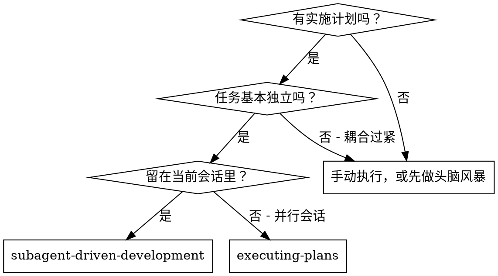
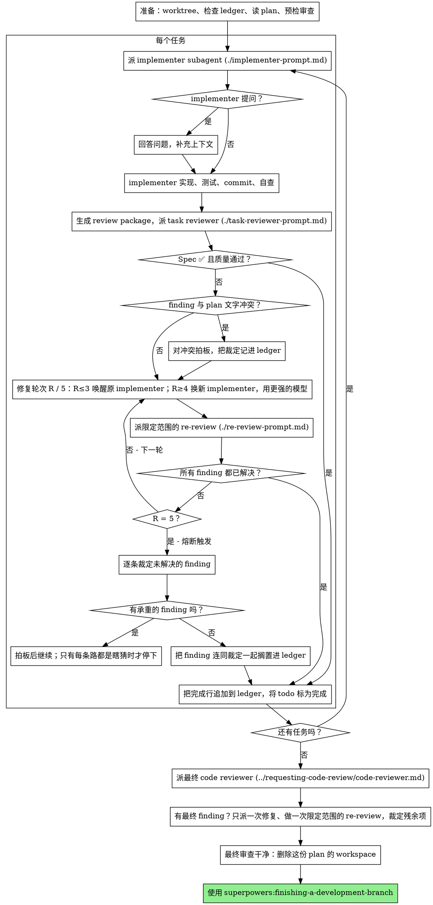

# Subagent 驱动开发

执行计划的做法：每个任务派一个全新的 implementer（实现者）subagent，每完成一个任务做一次 task review（任务审查：规格符合度 + 代码质量），全部任务做完再做一次覆盖整个 branch 的全面审查。

**为什么用 subagent：** 你把任务交给专门的 agent（代理），它们的上下文相互隔离。只要把指令和上下文准备得精准，它们就能保持专注、把任务干成。它们绝不该继承你所在会话的上下文或历史——它需要什么，由你精确地造出来。这么做也把你自己的上下文省下来做协调。

**核心原则：** 每个任务一个新 subagent + 任务审查（规格 + 质量）+ 最后的全面审查 = 高质量、快速迭代

**旁白：** 工具调用之间，最多用一句话交代。记录由 ledger（账本）和工具结果来承载。

**连续执行：** 任务之间不要停下来找人类搭档确认。把计划里的所有任务一口气做完。能让你停下的，只有下面说到的四种情况，或者所有任务都完成了。「要不要继续？」这类询问和进度汇报只会浪费他们的时间——他们让你执行计划，那就执行。

**要拍板，不要卡壳。** 计划一旦跑起来，就不等人。冲突、含糊、计划缺陷、你想申请突破的上限——这些都由你自己拍板。spec（规格）是约束性权威，plan 是它的论据，两者都答不了的地方由你的判断来定。每个决定都要记进 ledger，格式是 `Ruling: <what you decided> — <why> — <what it costs if wrong>`，然后继续往下走。判错了，代价是返工，人类搭档看得见也能撤销；而一个会话卡在某个问题上，耗掉他们一整天，什么也换不来。

只有四种情况能让你停下来：不可逆或破坏性操作；涉及安全敏感的动作；会影响到这个 worktree 之外、按惯例应当先问过再做的副作用（合并、往共享 branch 上 push、发布）；以及计划烂到每条路都是瞎猜。遇到这四种，停下来问。

## 何时使用



**与 Executing Plans（并行会话）的对比：**
- 同一个会话（不用切换上下文）
- 每个任务用一个全新的 subagent（不污染上下文）
- 每完成一个任务就审查（规格符合度 + 代码质量），最后再来一次全面审查
- 迭代更快（任务之间不需要人参与）

## 流程



## 准备工作

确保工作在隔离的 workspace（工作区）里进行：用 superpowers:using-git-worktrees 创建一个，或者确认已有的那个可用。没有人类搭档的明确同意，绝不在 main/master branch 上开始实施。

对话记忆扛不过上下文压缩（compaction）。真实会话里，丢失进度的控制器曾把整串已完成的任务重新派了一遍——这是观察到的最昂贵的一种失败。进度要记在 ledger 文件里，不能只记在 todos 里。

- 每份 plan 有自己的 workspace：技能一开始，运行本技能的 `scripts/sdd-workspace PLAN_FILE`——它会打印这份 plan 专属的、被 git 忽略的目录（`<repo-root>/.superpowers/sdd/<plan-basename>/`），这个目录存放这份 plan 的全部产物：ledger、briefs、reports、review packages。别的 plan 的目录，你既不能读也不能写。
- 到 `<workspace>/progress.md` 检查这份 plan 的 ledger。如果它的第一行指的就是你的 plan 文件，那么凡是带 `Task <N>: complete` 行的任务都已完成——不要重新派；从第一个没有该行的任务接着做。某个任务最后一行是 fix round（修复轮次），说明它卡在循环里：从下一轮接着跑。如果 ledger 第一行指的是别的 plan 文件——或者是旧扁平路径 `.superpowers/sdd/progress.md` 下的一份游离 ledger——那是别的 plan 的进度：原样放着，自己新起一份。
- 建 ledger 时把它的身份写在第一行：`# SDD ledger — plan: <plan file path>`。
- ledger 是你的恢复地图：它点名的 commit 就在 git 里，哪怕你的上下文已经不记得创建过它们。压缩之后，以 ledger 和 `git log` 为准，别信自己的记忆。
- `git clean -fdx` 会毁掉 workspace（它是被 git 忽略的临时目录）；真发生了，就从 `git log` 里恢复。

把 plan 读一遍，记下它的上下文和 Global Constraints（全局约束），每个任务建一个 todo。如果 plan 点名了某个 Spec，也把它读了：spec 是 plan 据以论证的权威，plan 内部的冲突要按它来裁定。读不到 spec 的 plan，在 ledger 里记一笔说明这一点——这种情况下作出的裁定都是暂定的。

派 Task 1 之前，把 plan 扫一遍找冲突，边扫边记下你查了什么：

- 彼此矛盾、或者跟 plan 的 Global Constraints 矛盾的任务
- plan 明确要求、但审查标准视为缺陷的东西（不做任何断言的 test、逐字重复的 logic block）

扫描的产出是一张表，不是结论。每一对共用同一个文件或接口的任务占一行：这两个任务、一方产出什么对另一方消费什么、你发现了什么。每一个任务也各占一行：它自己的文字是否自洽——它规定的 test 对它规定的 code、它创建的文件对它后来会改的文件。「扫描很干净」这句话，没有这些行就不算你真扫过。

把这张表写进 ledger。执行开始前，对你发现的每一处都要拍板——每条发现都对上规定它的 plan 文字——并把每条裁定记进 ledger。扫描干净就直接往下走，不用多说。扫出来的每个冲突都要裁定——spec 是约束性权威，plan 是它的论据——把裁定记在对应那一行旁边，然后派 Task 1。那些只有实施过程中才暴露出来的冲突，由 review loop 兜底。

## 模型选择

每个角色都挑能胜任的最弱的模型，省成本、提速度。

**机械式实施任务**（孤立的函数、规格清晰、1-2 个文件）：用快而便宜的模型。plan 写得够清楚时，多数实施任务都算机械式。

**集成与判断类任务**（多文件协调、模式匹配、调试）：用标准模型。

**架构与设计任务**：用手边最强的模型。最后那次覆盖整个 branch 的审查就属于这类——要用最强的模型来派它，而不是会话默认的那个。

**审查任务**：同样按 diff 的规模、复杂度、风险来挑模型。小的机械式 diff 不需要最强的模型；细微的并发改动则需要。针对小修复 diff 的限定范围 re-review，用便宜到中等档即可。

**修复循环的升级（第 4-5 轮）**：用比卡住的那个 implementer 至少高一档的模型。

**派 subagent 时永远显式指定模型。** 不指定就会继承你所在会话的模型——往往是最强也最贵的那个——这一节就白写了。

**轮数比 token 单价更重要。** 真实耗时和上下文开销随 subagent 的轮数增长，而最便宜的模型在多步任务上常常要多花 2-3 倍的轮数——总成本反而更高。审查者、以及照文字描述干活的 implementer，以中等档模型为下限。如果任务的 plan 文字里已经给出了要写的完整代码，那实施就是照抄加测试：这种 implementer 用最便宜的档。单文件的机械式修复也用最便宜的档。

**任务复杂度的判断信号（实施任务）：**
- 规格完整、只碰 1-2 个文件 → 便宜模型
- 碰多个文件、有集成上的顾虑 → 标准模型
- 需要设计判断、或要对整个代码库有较广的理解 → 最强的模型

## 任务循环

**把小而同类的工作打包。** 如果 plan 里列了好几个任务，每个都是同一种小改动——同样的单行修复、常量修改、字段新增，在多个文件里重复——就不要一个任务派一个 subagent。写一份 dispatch brief，把每个文件和它的改动都列上，整批交给一个 subagent，把它的 diff 当成一个整体来审查。只有需要单独判断、单独测试、或单独审查面的工作，才一个任务派一次。

你粘进 dispatch prompt 的所有内容——以及 subagent 回显的所有内容——都会在本会话剩下的时间里一直待在你的上下文里，之后每一轮都被重读一遍。产物一律用文件传递。

**等待已派出的 subagent：** 不要用很短的超时去轮询等待接口，也不要干坐着无限期地等。手上有活时——更新 ledger、打下一个 review 的包、读报告——就继续干；子代理的结果会自己回来。真没事做的时候，分小段时间来等（平台允许的话，五到十分钟一段），两段之间发一行状态，并清点还活着的子代理：把它们列出来，哪个完成了却没回报就去追。分段时间等，几乎能保留长等待的全部效率，又能保证卡住或走丢的子代理在几分钟内被发现，而不是拖到会话末尾。

### 1. 派 implementer

派之前先记下 BASE（`git rev-parse HEAD`）——review package 和 fix round 的 diff 都要用。

- **Task brief：** 派 implementer 之前，运行本技能的 `scripts/task-brief PLAN_FILE N`——它把该任务的完整文字抽到一个唯一命名的文件里，并打印路径。组织 dispatch 时，让 brief 始终作为需求的唯一来源。你的 dispatch 应当包含：(1) 一行说明这个任务在项目里的位置；(2) brief 路径，并说明「先读这个——它是你的需求，里面的确切值要原样照用」；(3) brief 无从知道的、来自前序任务的接口和决定；(4) 你对 brief 中发现的任何含糊之处的裁定；(5) report 文件路径和 report 契约。确切值（数字、魔法字符串、签名、测试用例）只出现在 brief 里。绝不要让 subagent 去读整个 plan 文件。
- **Report 文件：** 按 brief 的名字给 implementer 的 report 文件命名（brief `…/task-N-brief.md` → report `…/task-N-report.md`），并写进 dispatch prompt。implementer 把完整报告写在那里，只返回 status、commits、一行测试摘要和顾虑。
- 一份 dispatch prompt 只描述一个任务，不写会话的历史。不要把之前任务的摘要累积起来（「Tasks 1-3 之后的状态」）粘进后面的 dispatch——真实会话里有一份 dispatch 到了 42k 字符，其中 99% 是粘进来的历史。新 subagent 只需要它的任务、它要碰的接口、以及全局约束。别的都不需要。
- dispatch 里要带上「不许再派 subagent」的约定（implementer 模板里有）：implementer 永远不派 subagent——不派帮手，更不派审查者。审查由你在报告之后派。真实会话里，worker 自己派出的每一个审查者，都和控制器本来就派了的 task review 重复——每个任务白白多出一个审查席位。
- 如果前面的任务在本次任务要碰的范围内搁置过某条 finding，就在 dispatch 里带上指向那条 ledger 记录的索引。
- 从 dispatch 结果里记下 implementer 的 agent 身份——修复循环的第 1-3 轮要唤醒这个 agent。
- 绝不要并行派多个实施 subagent（会冲突）。

模板：[implementer-prompt.md](implementer-prompt.md)

### 2. 处理报告

implementer subagent 会回报四种状态之一。分别这样处理：

**DONE：** 生成 review package（`scripts/review-package PLAN_FILE BASE HEAD`，在本技能的目录下运行——它会打印写出的唯一文件路径；BASE 是你派 implementer 之前记下的那个 commit——绝不要用 `HEAD~1`，它会悄悄丢掉多 commit 任务里除最后一个之外的所有 commit），然后用打印出来的路径去派 task reviewer。

**DONE_WITH_CONCERNS：** implementer 完成了工作，但标出了疑虑。往下走之前先把顾虑读了。如果顾虑涉及正确性或范围，先解决再审查。如果只是观察（比如「这个文件越来越大」），记一笔，继续审查。

**NEEDS_CONTEXT：** implementer 需要没提供过的信息。补上缺的上下文，重新派。

**BLOCKED：** implementer 完不成这个任务。评估卡点：
1. 如果是上下文问题，补更多上下文，用同一个模型重新派
2. 如果任务需要更强的推理，换更强的模型重新派
3. 如果任务太大，拆成更小的块
4. 如果 plan 本身就是错的，对更正拍板，记进 ledger，把该裁定带进 dispatch 重新派

**绝不**无视升级，也绝不逼同一个模型原样重试。implementer 说了卡住，那就得有东西变。

如果 implementer 提问——开工前或干到一半——都要答得清楚、完整，需要的话补上额外上下文，别催它赶紧动手。

### 3. 审查任务

每个任务的审查是限定在该任务范围内的关卡。全面审查只做一次，放在最后那次覆盖整个 branch 的 review 里。绝不能跳过任务审查，也绝不接受缺了任一结论的报告——规格符合度和任务质量，两个都要。implementer 的自查永远代替不了任务审查；两者都需要。

- 把 diff 作为文件交给审查者：运行本技能的 `scripts/review-package PLAN_FILE BASE HEAD`，把它打印出来的文件路径传给审查者（没有 bash 的话：把 `git log --oneline`、`git diff --stat`、以及该范围的 `git diff -U10` 重定向到一个唯一命名的文件）。输出绝不进入你自己的上下文，审查者一次 Read 调用就能看到 commit 列表、stat 摘要、以及带上下文的完整 diff。用你派 implementer 之前记下的 BASE——绝不要用 `HEAD~1`，它会悄悄截断多 commit 任务。没有 diff 文件，绝不派 task reviewer。
- **审查者的输入：** task reviewer 拿到三个路径——同一个 brief 文件、report 文件、review package——外加约束该任务的全局约束。
- 你交给审查者的全局约束块，是它的注意力透镜。从 plan 的 Global Constraints 一节或 spec 里逐字抄下约束性要求：确切的值、确切的格式、以及组件之间写明的关系（「与 X 布局相同」「与 Y 匹配」）。审查者模板里已经带了流程规则（YAGNI、测试卫生、审查方法）——约束块负责的是这份项目 spec 的要求。
- 没有具体的、针对该任务的理由，就不要加「检查所有调用处」「有用的话跑一下竞态测试」这类开放式指令
- 不要让审查者重跑 implementer 已经在同一份代码上跑过的测试——implementer 的报告就是测试证据
- 不要替审查者预先判断 finding——绝不要指示审查者忽略或不标记某个具体问题。如果你觉得某条 finding 会是误报，让审查者提出来，在 review loop 里裁定。你正在写的 prompt 里如果出现「不要标记」「别把 X 当作缺陷」「最多算 Minor」「plan 就是这么选的」——打住：你在预设判断，多半是想给自己省掉一轮 review loop。
task reviewer 可能回报「⚠️ 无法从 diff 核实」的条目——这些要求落在未改动的代码里，或横跨多个任务。它们不阻断审查的其余部分，但你在把任务标为完成之前，必须自己逐条解决：plan 和跨任务的上下文在你手上，审查者没有。如果你确认某条确实是个缺口，就当作 spec 审查没通过——它和其他 finding 一起进修复循环。

模板：[task-reviewer-prompt.md](task-reviewer-prompt.md)

### 4. 修复循环

当审查报出 spec ❌、任何 Critical 或 Important 的 finding、或你确认为真实缺口的 ⚠️ 条目时，循环启动。

循环开始前，有两条路直接离开循环：

- Minor 的 finding 随手记进 progress ledger（`Task <N>: minor (deferred): <one-liner>`），并让最后那次覆盖整个 branch 的 review 指向这份清单，好让它判断哪些必须在合并前修掉。没人看的汇总等于悄悄丢弃。Minor 的 finding 永远不进循环。
- 标为 plan-mandated 的 finding——或者任何与 plan 文字要求相冲突的 finding——由你裁定：把 finding 和 plan 文字对照权衡，以 spec 为约束性权威来定夺，动手之前先把裁定记进 ledger。不要因为 plan 要求它就把 finding 驳回，也不要在没有记录裁定的情况下派一个与 plan 相抵触的修复。

其余的一切都进循环。一个 fix round 等于一次派修复加一次限定范围的 re-review。每个任务最多五轮：

**第 1-3 轮——唤醒原 implementer。** 把未解决的 finding 原样发给它。它的上下文还在：它了解这个任务、这份代码、以及它自己的选择。如果你的运行环境没法给一个还活着的 subagent 再发消息，就派一个新 implementer，带上 brief 路径、report 文件路径和这些 finding——无论哪种方式，report 文件都是持久记忆。

**第 4-5 轮——换更强的模型，派一个全新的 implementer**（按「模型选择」一节），带上 brief 路径、report 文件路径、未解决的 finding，以及这句话：「之前有个 implementer 试过这个任务 [N] 次；现在归你了。读 report 文件看都试过什么。」一个挺过三次唤醒的循环，通常说明 implementer 看不见自己的问题——换个新人、顺便提一档能力，一次到位。

**每一轮，不管哪种方式：** implementer 修好，重跑覆盖被改代码的测试，把修复报告追加到同一个 report 文件，然后返回那份简短契约。重新派审查者之前，确认修复报告里含覆盖测试、运行的命令、输出这三样；三样齐了再派 re-review。在修复消息里点名覆盖的测试文件——单行修复不需要跑整套测试。

**re-review 是限定范围的。** 运行 `scripts/review-package PLAN_FILE FIX_BASE HEAD`，其中 FIX_BASE 是上一次审查看到的 head，然后用 finding 清单、brief、report 文件和打印出的 diff 路径去派 [re-review-prompt.md](re-review-prompt.md)。re-reviewer 对每条 finding 判定 ADDRESSED 或 NOT ADDRESSED，并且只标记修复 diff 里新出现的破坏。修复 diff 里新的 Critical/Important 破坏，加入未解决 finding 清单。超范围的观察记进 ledger 当作延后的 minor——它们永远不延长循环。

**每一轮之后，** 往 ledger 追加：
`Task <N>: fix round <R>/5 (<X> addressed, <Y> open — <finding one-liners>; commits <a7>..<b7>)`

绝不要自己在 controller 会话里修 finding——你的上下文要保持干净，好做协调；而且 controller 自己修的会跳过审查。

**熔断。** 第 5 轮的 re-review 后仍有 finding 未解决时，停止派发。未解决的 finding 你自己逐条裁定——plan 和跨任务的上下文在你手上，审查者没有：

- **审查者错了，或者这点可以商榷：** 搁置它——`Task <N>: parked — <finding> — Ruling: <why the code stands>`。最后的审查会看到双方说法。
- **是真的，但下游没有东西依赖它：** 同样搁置，裁定里写明它是真的、只是延后处理。
- **是真的，而且承重**——后面的任务依赖它，或者它暴露了 plan 缺陷：对能解开依赖工作的最小改动拍板，记成 `Task <N>: Ruling: <finding> — <what you decided and why>`，并把它带进下一个任务的 dispatch。把结构性的失败悄悄搁置，会让每个依赖它的任务建在它上面。只有缺陷烂到每条路都是瞎猜时才停。

只在上限处裁定。提前裁定来结束循环，不过是换了名字的预设判断。每次裁定都是 ledger 里的一条——禁止悄悄丢弃。

### 5. 完成该任务

审查干净地返回时——或者到了上限、每条未解决的 finding 都带着裁定搁置时——把完成行追加到 ledger，和你其他记账写在同一条消息里：

- `Task <N>: complete (commits <base7>..<head7>, review clean)`
- 熔断触发之后：`Task <N>: complete (commits <base7>..<head7>, <K> parked)`

然后把这个 todo 标为完成，继续往下。只要审查还有未解决的 Critical/Important 问题，既没修好、也没在上限处带裁定搁置，就绝不进入下一个任务。

## 最终审查

最后那次覆盖整个 branch 的审查也要一个包：运行 `scripts/review-package PLAN_FILE MERGE_BASE HEAD`（MERGE_BASE = 这个 branch 起始的那个 commit，比如 `git merge-base main HEAD`），把打印出的路径放进最终审查的 dispatch，这样最终审查者只读一个文件，不用再用 git 命令重新推导 branch diff。用手边最强的模型来派（见「模型选择」），套用 superpowers:requesting-code-review 的 [code-reviewer.md](../requesting-code-review/code-reviewer.md)。让它指向 ledger 里延后的 minor 行和搁置行，好判断哪些必须在合并前修掉。

如果最终的整 branch 审查返回了 finding，派一个修复 subagent，带上完整的 finding 清单——不是每条 finding 派一个修复者。每条 finding 各派一个修复者，会各自重建上下文、各自重跑测试套件；真实会话里，最终审查的修复波次比它所有任务加起来还贵。然后对这一波修复只做一次限定范围的 re-review（对修复范围运行 `scripts/review-package PLAN_FILE FIX_BASE HEAD`，套用 [re-review-prompt.md](re-review-prompt.md)）。残余的 finding 按任务循环里熔断那一套来裁定：带裁定搁置，或者对承重的那些拍板，并把你的决定记进 ledger。到这里能让你停下的只有上面那四类情况。没有第二波修复——残余的承重 finding，会在 finishing-a-development-branch 给出选项时呈到你的搭档面前。

## 收尾

删除任何东西之前，把 ledger 里所有含 `Ruling:` 的行收集起来——预检裁定、搁置的 finding、熔断裁定，全部都要——放进你最终消息里「我做过的裁定」一节，按你做决定的顺序排，每条都写明判错了会付出什么代价。这份清单要穷尽：ledger 里有哪条裁定，清单里就有哪条。你替人类搭档做的决定，只有通过这份清单才能到达他们那里——他们读了，把你搞错的地方返工。一条随 workspace 一起消失的裁定，就是一个偷偷做出的决定。

当最终的整 branch 审查干净、它的修复也合并了，删掉这份 plan 的 workspace（`rm -rf <workspace>`）——现在记录就在 git 历史里了。同级的兄弟目录属于别的 plan；别去动它们。

用 superpowers:finishing-a-development-branch。

## 常见的自我辩解

| 借口 | 事实 |
|--------|---------|
| 「规格符合度差不多就行了」 | 审查者发现了规格缺口 = 没做完。要么修，要么到上限去裁定——只有这两条出路。 |
| 「我自己修吧，派发太费事」 | controller 自己修会污染上下文、还会跳过审查。唤醒 implementer。 |
| 「再来一轮就收敛了」 | 过了上限，轮次不会收敛——失败是结构性的。裁定并分流。 |
| 「反正审查者还会找出新东西」 | 限定范围的 re-review 只核实修复，不会游走。未改动代码上的新 finding 进 ledger，不进循环。 |
| 「这条 finding 明显错了，我丢掉」 | 只在上限处裁定，而且每条裁定都是 ledger 里的一条。禁止悄悄丢弃。 |
| 「修复很小，跳过 re-review 吧」 | 没经审查的修复，正是回归落地的方式。每一轮都以限定范围的 re-review 收尾。 |
| 「审查拖慢了循环」 | 没有审查的循环只是没验证过的瞎忙。审查是循环的刹车和方向盘。 |
| 「记账太费事」 | ledger 才是能扛过压缩的东西。没有 ledger 的 controller 曾把整串已完成的任务重新派了一遍。 |
| 「implementer 自己派了审查者——白送一层保障」 | 那是重复的席位，审的是同一份 diff；task review 才是关卡。worker 自己派审查者是要标记的缺陷，不是严谨。 |

## 示例流程

```
你：我在用 Subagent-Driven Development 执行这份 plan。

[准备工作：worktree 已确认]
[把 plan 文件读一遍：docs/superpowers/plans/feature-plan.md]
[确定 workspace：scripts/sdd-workspace docs/superpowers/plans/feature-plan.md —— 里面没有 ledger，全新开始]
[给所有任务创建 todo]

Task 1：Hook 安装脚本

[为 Task 1 跑 task-brief；派 implementer，带上 brief 路径 + report 路径 + 上下文]

Implementer：「开工前问一下——hook 该装到用户级还是系统级？」

你：「用户级（~/.config/superpowers/hooks/）」

Implementer：[稍后]
  - 实现了 install-hook 命令
  - 加了测试，5/5 通过
  - 自查：发现漏了 --force 标志，补上了
  - 已 commit

[跑 review-package PLAN_FILE BASE HEAD；用打印出的路径派 task reviewer]
Task reviewer：Spec ✅ —— 所有需求都满足，没有多余的东西。
  Strengths：测试覆盖好、干净。Issues：无。Task quality：Approved。

[Ledger：Task 1: complete (commits a1b2c3d..d4e5f6a, review clean)]

Task 2：恢复模式

[为 Task 2 跑 task-brief；派 implementer，带上 brief 路径 + report 路径 + 上下文]

Implementer：[没问题]
  - 加了 verify/repair 模式
  - 8/8 测试通过
  - 已 commit

[跑 review-package PLAN_FILE BASE HEAD；用打印出的路径派 task reviewer]
Task reviewer：Spec ❌：
  - 缺：进度上报（spec 说「每 100 项上报一次」）
  Issues (Important)：魔法数字（100）

[修复第 1 轮：唤醒 implementer，带上两条 finding]
Implementer：加了进度上报，抽出了 PROGRESS_INTERVAL 常量。
  重跑了 test/recovery.test.js —— 10/10 通过。修复报告已追加。

[跑 review-package PLAN_FILE FIX_BASE HEAD；派限定范围的 re-review]
Re-reviewer：缺进度上报 —— ADDRESSED（src/recovery.js:41）。
  魔法数字 —— ADDRESSED（src/recovery.js:7）。新破坏：无。
  Verdict：所有 finding 均已解决。

[Ledger：Task 2: fix round 1/5 (2 addressed, 0 open; commits d4e5f6a..b7c8d9e)]
[Ledger：Task 2: complete (commits d4e5f6a..b7c8d9e, review clean)]

...

[所有任务做完后]
[跑 review-package PLAN_FILE MERGE_BASE HEAD；派最终 code-reviewer，用最强模型]
Final reviewer：所有需求都满足。延后的 minor 已甄别：没有阻塞合并的。

[删掉这份 plan 的 workspace —— 记录现在存在 git 里]

完成！采用 superpowers:finishing-a-development-branch。
```
