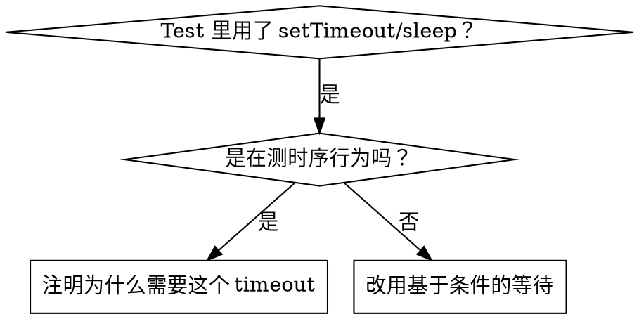

# 基于条件的等待

## 概览

不稳定的 test 常常靠随便定一个延迟来猜时间。这会埋下 race condition（竞态条件）：在快机器上 test 能过，一上负载或在 CI 里就挂。

**核心原则：** 等的是你真正关心的那个条件，而不是猜它要花多久。

## 什么时候用



**适用场景：**
- Test 里有随便定的延迟（`setTimeout`、`sleep`、`time.sleep()`）
- Test 不稳定（有时候过，一上负载就挂）
- Test 并行跑的时候就超时
- 要等异步操作完成

**不适用场景：**
- 就是在测真正的时序行为（debounce、throttle 的间隔）
- 如果用固定延迟，永远都要注明为什么

## 核心模式

```typescript
// ❌ BEFORE: Guessing at timing
await new Promise(r => setTimeout(r, 50));
const result = getResult();
expect(result).toBeDefined();

// ✅ AFTER: Waiting for condition
await waitFor(() => getResult() !== undefined);
const result = getResult();
expect(result).toBeDefined();
```

## 常用写法

| 场景 | 写法 |
|----------|---------|
| 等某个事件 | `waitFor(() => events.find(e => e.type === 'DONE'))` |
| 等某个状态 | `waitFor(() => machine.state === 'ready')` |
| 等数量到位 | `waitFor(() => items.length >= 5)` |
| 等文件出现 | `waitFor(() => fs.existsSync(path))` |
| 复杂条件 | `waitFor(() => obj.ready && obj.value > 10)` |

## 实现

通用的轮询函数：
```typescript
async function waitFor<T>(
  condition: () => T | undefined | null | false,
  description: string,
  timeoutMs = 5000
): Promise<T> {
  const startTime = Date.now();

  while (true) {
    const result = condition();
    if (result) return result;

    if (Date.now() - startTime > timeoutMs) {
      throw new Error(`Timeout waiting for ${description} after ${timeoutMs}ms`);
    }

    await new Promise(r => setTimeout(r, 10)); // Poll every 10ms
  }
}
```

完整实现见本目录下的 `condition-based-waiting-example.ts`，里面有针对具体场景的辅助函数（`waitForEvent`、`waitForEventCount`、`waitForEventMatch`），都是来自真实调试记录。

## 常见错误

**❌ 轮询太快：** `setTimeout(check, 1)` —— 浪费 CPU
**✅ 改法：** 每 10ms 轮询一次

**❌ 没有超时：** 条件永远不满足就死循环
**✅ 改法：** 一定要带上超时，并给出明确的报错

**❌ 数据过期：** 在循环开始前就把状态缓存下来
**✅ 改法：** 在循环内部调用 getter，拿最新的数据

## 什么时候固定延迟是对的

```typescript
// Tool ticks every 100ms - need 2 ticks to verify partial output
await waitForEvent(manager, 'TOOL_STARTED'); // First: wait for condition
await new Promise(r => setTimeout(r, 200));   // Then: wait for timed behavior
// 200ms = 2 ticks at 100ms intervals - documented and justified
```

**要求：**
1. 先等触发条件
2. 基于已知的时序（不是靠猜）
3. 写注释说明为什么

## 实际效果

来自一次调试记录（2025-10-03）：
- 修好了 3 个文件里 15 个不稳定的 test
- 通过率：60% → 100%
- 执行时间：快了 40%
- 再也没有 race condition
