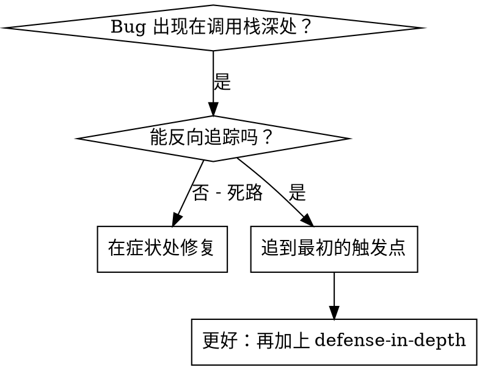
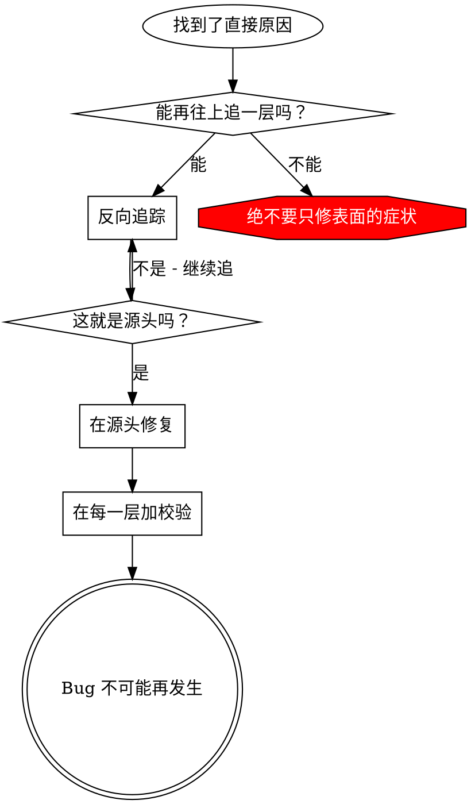

# Root Cause 反向追踪

## 概览

Bug 常常在调用栈很深的地方才冒出来（git init 跑到了错误的目录，文件创建到了错误的位置，数据库用错误的路径打开）。你的本能是想在报错出现的地方修，但那只是在治症状。

**核心原则：** 沿着调用链往上反向追，一直找到最初的触发点，然后在源头修。

## 什么时候用



**适用场景：**
- Error 发生在执行的很深处（不在入口）
- Stack trace 显示调用链很长
- 不清楚非法数据是从哪儿来的
- 需要找出是哪个 test、哪段代码触发了问题

## 追踪流程

### 1. 观察症状
```
Error: git init failed in ~/project/packages/core
```

### 2. 找到直接原因
**是哪段代码直接导致的？**
```typescript
await execFileAsync('git', ['init'], { cwd: projectDir });
```

### 3. 问一句：谁调用了它？
```typescript
WorktreeManager.createSessionWorktree(projectDir, sessionId)
  → called by Session.initializeWorkspace()
  → called by Session.create()
  → called by test at Project.create()
```

### 4. 继续往上追
**传进来的是什么值？**
- `projectDir = ''`（空字符串！）
- 空字符串作为 `cwd` 会被解析成 `process.cwd()`
- 那就是源码目录！

### 5. 找到最初的触发点
**空字符串是从哪儿来的？**
```typescript
const context = setupCoreTest(); // Returns { tempDir: '' }
Project.create('name', context.tempDir); // Accessed before beforeEach!
```

## 加入 Stack Trace

手动追不动的时候，就加埋点：

```typescript
// Before the problematic operation
async function gitInit(directory: string) {
  const stack = new Error().stack;
  console.error('DEBUG git init:', {
    directory,
    cwd: process.cwd(),
    nodeEnv: process.env.NODE_ENV,
    stack,
  });

  await execFileAsync('git', ['init'], { cwd: directory });
}
```

**关键点：** 在 test 里用 `console.error()`（不要用 logger——可能不显示）

**运行并抓取输出：**
```bash
npm test 2>&1 | grep 'DEBUG git init'
```

**分析 stack trace：**
- 找 test 文件名
- 找到触发调用的行号
- 找出规律（是同一个 test？同一个参数？）

## 找出是哪个 test 造成了污染

如果某个东西只在跑 test 时出现，但你不知道是哪个 test：

用本目录下的二分查找脚本 `find-polluter.sh`：

```bash
./find-polluter.sh '.git' 'src/**/*.test.ts'
```

它逐个跑 test，遇到第一个污染源就停下。用法见脚本本身。

## 真实案例：空的 projectDir

**症状：** `.git` 被创建到了 `packages/core/`（源码目录）

**追踪链：**
1. `git init` 在 `process.cwd()` 里跑 ← cwd 参数是空的
2. WorktreeManager 收到的是空的 projectDir
3. Session.create() 传入了空字符串
4. Test 在 beforeEach 之前就访问了 `context.tempDir`
5. setupCoreTest() 一开始返回的是 `{ tempDir: '' }`

**Root cause：** 顶层变量初始化时访问了一个空值

**修复：** 把 tempDir 改成 getter，一旦在 beforeEach 之前被访问就抛错

**同时加上了 defense-in-depth：**
- Layer 1：Project.create() 校验目录
- Layer 2：WorkspaceManager 校验不为空
- Layer 3：NODE_ENV 守卫，拒绝在 tmpdir 之外执行 git init
- Layer 4：git init 之前记录 stack trace

## 关键原则



**绝不要只修报错出现的那一处。** 往回追，找到最初的触发点。

## Stack Trace 小技巧

**在 test 里：** 用 `console.error()`，不要用 logger——logger 可能被抑制
**在操作之前：** 在危险操作之前打 log，而不是等它失败了再打
**带上上下文：** 目录、cwd、环境变量、时间戳
**抓取调用栈：** `new Error().stack` 能显示完整的调用链

## 实际效果

来自一次调试记录（2025-10-03）：
- 通过 5 层追踪找到了 root cause
- 在源头修复（用 getter 做校验）
- 加了 4 层防御
- 1847 个 test 全过，零污染
