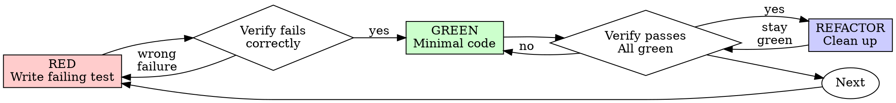

# 测试驱动开发（TDD）

## 概述

先写 test（测试，指一段自动检查代码对不对的程序）。看着它失败。再写最少的代码让它通过。

**核心原则：** 如果你没亲眼看到 test 失败，你就不知道它测的是不是对的东西。

**违反规则的字面要求，就是违反规则的精神。**

## 什么时候用

**总是：**
- 新功能
- 修 bug
- 重构
- 改变行为

**例外（先问你的搭档）：**
- 用完就扔的原型
- 生成的代码
- 配置文件

想「就这一次，跳过 TDD」？打住。这是自我合理化。

## 铁律

```
NO PRODUCTION CODE WITHOUT A FAILING TEST FIRST
```

先写代码再写 test？删掉。重来。

**没有例外：**
- 不要把它留着当「参考」
- 不要一边写 test 一边「改改它»
- 不要看它
- 删除就是删除

从 test 重新实现一遍。就这样。

## 红-绿-重构



### RED —— 写一个会失败的 test

写一个最小的 test，说明应该发生什么。

<Good>
```typescript
test('retries failed operations 3 times', async () => {
  let attempts = 0;
  const operation = () => {
    attempts++;
    if (attempts < 3) throw new Error('fail');
    return 'success';
  };

  const result = await retryOperation(operation);

  expect(result).toBe('success');
  expect(attempts).toBe(3);
});
```
名字清楚，测的是真实行为，只测一件事
</Good>

<Bad>
```typescript
test('retry works', async () => {
  const mock = jest.fn()
    .mockRejectedValueOnce(new Error())
    .mockRejectedValueOnce(new Error())
    .mockResolvedValueOnce('success');
  await retryOperation(mock);
  expect(mock).toHaveBeenCalledTimes(3);
});
```
名字含糊，测的是 mock 而不是代码
</Bad>

**要求：**
- 只测一种行为
- 名字清楚
- 用真实代码（除非实在没办法，否则别用 mock）

### 验证 RED —— 看着它失败

**强制。绝不允许跳过。**

```bash
npm test path/to/test.test.ts
```

确认：
- test 失败（而不是报错）
- 失败信息符合预期
- 失败的原因是功能缺失（不是打错字）

**test 通过了？** 那你测的是已经存在的行为。改 test。

**test 报错了？** 先修错误，重跑，直到它正确地失败。

### GREEN —— 最少的代码

写最简单的代码让 test 通过。

<Good>
```typescript
async function retryOperation<T>(fn: () => Promise<T>): Promise<T> {
  for (let i = 0; i < 3; i++) {
    try {
      return await fn();
    } catch (e) {
      if (i === 2) throw e;
    }
  }
  throw new Error('unreachable');
}
```
刚好够通过
</Good>

<Bad>
```typescript
async function retryOperation<T>(
  fn: () => Promise<T>,
  options?: {
    maxRetries?: number;
    backoff?: 'linear' | 'exponential';
    onRetry?: (attempt: number) => void;
  }
): Promise<T> {
  // YAGNI
}
```
过度设计
</Bad>

不要加功能，不要重构别的代码，不要超出 test 去「改进」。

### 验证 GREEN —— 看着它通过

**强制。**

```bash
npm test path/to/test.test.ts
```

确认：
- test 通过
- 其他 test 仍然通过
- 输出干净（没有错误、没有警告）

**test 失败？** 改代码，不是改 test。

**其他 test 失败？** 现在就修。

### REFACTOR —— 清理

只在变绿之后：
- 去掉重复
- 改进命名
- 抽取辅助函数

保持 test 绿色。不要加行为。

### 重复

为下一个功能，写下一个会失败的 test。

## 好的 test

| 品质 | 好 | 坏 |
|---------|------|-----|
| **最小** | 只测一件事。名字里有「and」？拆开。 | `test('validates email and domain and whitespace')` |
| **清楚** | 名字描述了行为 | `test('test1')` |
| **体现意图** | 展示了期望的 API | 让人看不懂代码应该做什么 |

写或改任何 test 时，读 [writing-good-tests.md](writing-good-tests.md)，里面是让 test 保持诚实的规则：
- 写 test 之前，先说清楚哪个生产代码的改动会让这个 test 失败
- 断言真实行为，绝不断言 mock 行为
- 只给 test 用的代码放进 test 工具里，不要放进生产类
- 给依赖打 mock 之前，先搞懂它的副作用

## 常见的自我合理化

| 借口 | 真相 |
|--------|---------|
| 「太简单了不用测」 | 简单的代码也会坏。写 test 只要 30 秒。 |
| 「我待会儿再补 test」 | 事后写的 test 一上来就通过 —— 这什么都证明不了。它可能测错东西、测实现而不是行为，或者漏掉你忘掉的边界情况。你没看着它失败过，就没证明它能抓到 bug。test 先行逼出那次失败。 |
| 「事后补 test 达到同样的目标（看精神不看形式）」 | 事后写的 test 回答「这段代码做了什么」；先行的 test 回答「它应该做什么」。事后写的 test 被你已经写好的代码带偏了 —— 你验证的是你记得住的情况，而不是你本会发现的那些。有覆盖率，却没证明 test 有效。 |
| 「我已经手动测过了」 | 手动测试是随手的：没记录你覆盖了什么，代码一改没办法重跑，一紧张就容易忘掉某些情况。「我试的时候是好使的」不等于全面。自动化 test 每次都按同样的方式跑。 |
| 「删掉好几个小时的工作太浪费了」 | 沉没成本谬误 —— 那段时间反正已经花掉了。真正的选择是：用 TDD 重写（高信心）还是留着它事后硬塞 test（低信心，很可能有 bug）。留着你不信任的代码才是浪费。 |
| 「留着当参考，先写 test」 | 你会去改它。那就变成事后测试了。删除就是删除。 |
| 「我需要先探索一下」 | 可以。探索完扔掉，从 TDD 开始。 |
| 「test 难写 = 设计不清晰」 | 听 test 的话。难测就是难用。 |
| 「TDD 会拖慢我」 | TDD 才是务实的路：在 commit 之前就抓到 bug，防止回归，让你敢放心重构。所谓「务实」的捷径，结果是去生产环境里 debug —— 更慢，不是更快。 |
| 「手动测更快」 | 手动证明不了边界情况。每次改动你都要重测。 |
| 「现有代码没有 test」 | 你正在改进它。给现有代码补 test。 |

## 危险信号 —— 停下，重来

- 先写代码再写 test
- 实现之后才写 test
- test 一上来就通过
- 说不清 test 为什么失败
- test 是「以后」加的
- 用「就这一次」自我合理化
- 「我已经手动测过了」
- 「事后补 test 达到同样的目的」
- 「重要的是精神不是形式」
- 「留着当参考」或「改改现有的代码」
- 「已经花了好几个小时，删掉太浪费」
- 「TDD 太教条了，我要务实一点」
- 「这次不一样，因为……」

**以上所有都意味着：删代码。用 TDD 重来。**

## 例子：修 bug

**Bug：** 空的 email 被接受了

**RED**
```typescript
test('rejects empty email', async () => {
  const result = await submitForm({ email: '' });
  expect(result.error).toBe('Email required');
});
```

**验证 RED**
```bash
$ npm test
FAIL: expected 'Email required', got undefined
```

**GREEN**
```typescript
function submitForm(data: FormData) {
  if (!data.email?.trim()) {
    return { error: 'Email required' };
  }
  // ...
}
```

**验证 GREEN**
```bash
$ npm test
PASS
```

**REFACTOR**
如果需要，把校验抽出来，支持多个字段。

## 验证清单

标记工作完成之前：

- [ ] 每个新函数/方法都有 test
- [ ] 实现之前，亲眼看着每个 test 失败
- [ ] 每个 test 都因为预期的原因失败（功能缺失，而不是打错字）
- [ ] 写了最少的代码让每个 test 通过
- [ ] 所有 test 都通过
- [ ] 输出干净（没有错误、没有警告）
- [ ] test 用的是真实代码（除非没办法才用 mock）
- [ ] 覆盖了边界情况和错误

有框没勾上？那你就跳过了 TDD。重来。

## 卡住的时候

| 问题 | 解法 |
|---------|----------|
| 不知道怎么写 test | 写出你希望的 API。先写断言。问你的搭档。 |
| test 太复杂 | 设计太复杂。简化接口。 |
| 什么都要 mock | 代码耦合太重。用依赖注入。 |
| test 的准备代码一大堆 | 抽成辅助函数。还是复杂？简化设计。 |

## 和调试的结合

发现 bug？写一个能复现它的、会失败的 test。走 TDD 循环。test 既证明修好了，又能防止回归。

没有 test，绝不修 bug。

## 最终规则

```
Production code → test exists and failed first
Otherwise → not TDD
```

没有搭档的许可，不设例外。
