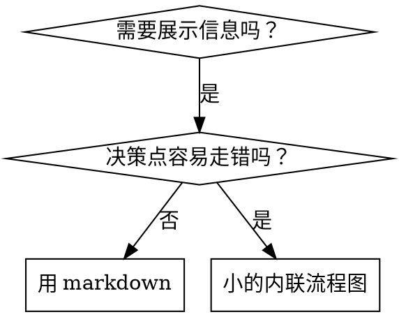

# 编写技能

## 概述

**写技能，就是把测试驱动开发（TDD）用到流程文档上。**

**个人技能放在你所运行的运行时的技能目录里**（在 Claude Code 上是 `~/.claude/skills/`）——Codex、Gemini 等运行时的路径见 [codex-tools.md](../using-superpowers/references/codex-tools.md) 或 [gemini-tools.md](../using-superpowers/references/gemini-tools.md)。Codex、Copilot CLI 和 Gemini CLI 也都认 `~/.agents/skills/` 这个跨运行时别名。

先写测试用例（用 subagent 跑压力场景），看它失败（基线行为），再写技能（文档），看测试通过（agent 遵守），最后重构（堵住漏洞）。

**核心原则：** 如果你没亲眼看着 agent 在没有技能时失败，你就不知道这个技能教的是不是对的东西。

**必备背景：** 使用本技能前，你必须理解 superpowers:test-driven-development。那个技能定义了基本的 RED-GREEN-REFACTOR 循环。本技能把 TDD 套用到文档上。

**官方指引：** Anthropic 官方的技能编写最佳实践见 anthropic-best-practices.md。该文档提供了额外的模式和准则，与本技能以 TDD 为核心的做法互为补充。

## 什么是技能？

**技能（skill）** 是一份参考指南，讲解经过验证的技术、模式或工具。技能帮助后来的 agent 找到并运用有效的做法。

**技能是：** 可复用的技术、模式、工具、参考指南

**技能不是：** 讲你某次怎么解决某个问题的故事

## 技能的 TDD 对应关系

| TDD 概念 | 技能创建 |
|-------------|----------------|
| **测试用例** | 用 subagent 跑的压力场景 |
| **产品代码** | 技能文档（SKILL.md） |
| **测试失败（RED）** | 没有技能时 agent 违反规则（基线） |
| **测试通过（GREEN）** | 有技能时 agent 遵守 |
| **重构** | 在保持遵守的前提下堵住漏洞 |
| **先写测试** | 写技能之前先跑基线场景 |
| **看它失败** | 逐字记录 agent 用的合理化借口 |
| **最小代码** | 写只针对那些具体违规行为的技能 |
| **看它通过** | 验证 agent 现在遵守了 |
| **重构循环** | 找新借口 → 堵住 → 再验证 |

整个技能创建过程都遵循 RED-GREEN-REFACTOR。

## 什么时候创建技能

**这些情况该创建：**
- 某项技术对你来说不是一眼就懂的
- 你会在不同项目中反复参考它
- 这个模式适用面广（不是某项目专用）
- 别人也能从中受益

**这些情况不该创建：**
- 一次性的解决方案
- 别处已有详细记录的标准做法
- 项目专用的约定（放进你的说明文件）
- 机械性的约束（如果正则或校验能强制，就自动化它——文档留给需要判断的地方）

## 技能类型

### 技术（Technique）
有具体步骤可循的方法（condition-based-waiting、root-cause-tracing）

### 模式（Pattern）
思考问题的方式（flatten-with-flags、test-invariants）

### 参考（Reference）
API 文档、语法指南、工具文档（office docs）

## 目录结构


```
skills/
  skill-name/
    SKILL.md              # 主参考文件（必需）
    supporting-file.*     # 只在需要时才有
```

**扁平命名空间** —— 所有技能放在同一个可搜索的命名空间里

**哪些内容拆成独立文件：**
1. **重量级参考**（100 行以上）—— API 文档、详尽的语法
2. **可复用工具** —— 脚本、实用工具、模板

**哪些内容留在正文里：**
- 原则和概念
- 代码模式（少于 50 行）
- 其他所有内容

## SKILL.md 的结构

**Frontmatter（YAML）：**
- 两个必需字段：`name` 和 `description`（支持的全部字段见 [agentskills.io/specification](https://agentskills.io/specification)）
- 总计最多 1024 个字符
- `name`：只能用字母、数字和连字符（不能有括号、特殊字符）
- `description`：用第三人称，只描述「什么时候用」（不描述「它做什么」）
  - 以「Use when...」开头，聚焦触发条件
  - 写清具体的症状、情形和场景
  - **绝不要概括技能的过程或工作流**（原因见 SDO 一节）
  - 尽量控制在 500 个字符以内

```markdown
---
name: Skill-Name-With-Hyphens
description: Use when [specific triggering conditions and symptoms]
---

# Skill Name

## Overview
What is this? Core principle in 1-2 sentences.

## When to Use
[Small inline flowchart IF decision non-obvious]

Bullet list with SYMPTOMS and use cases
When NOT to use

## Core Pattern (for techniques/patterns)
Before/after code comparison

## Quick Reference
Table or bullets for scanning common operations

## Implementation
Inline code for simple patterns
Link to file for heavy reference or reusable tools

## Common Mistakes
What goes wrong + fixes

## Real-World Impact (optional)
Concrete results
```


## 技能发现优化（SDO）

**对「能不能被发现」至关重要：** 后来的 agent 得能找到你的技能

### 1. 内容丰富的 description 字段

**目的：** 你的 agent 会读 description，来判断某个任务该加载哪些技能。要让它能回答：「我现在该读这个技能吗？」

**格式：** 以「Use when...」开头，聚焦触发条件

**关键：description 写的是「什么时候用」，不是「技能做什么」**

description 只应描述触发条件。不要在 description 里概括技能的过程或工作流。

**为什么这很重要：** 测试发现，当 description 概括了技能的工作流时，agent 可能会照着 description 去做，而不去读技能的完整内容。有个 description 写着「code review between tasks」（任务之间做代码审查），结果 agent 只做了一次审查，而技能的流程图明明画的是两次审查（先查规格符合，再查代码质量）。

把 description 改成纯粹的「Use when executing implementation plans with independent tasks」（不带工作流概括）之后，agent 就正确地读了流程图，遵循了两阶段审查流程。

**陷阱在于：** 概括工作流的 description 会给 agent 开一条捷径。技能正文就此沦为 agent 跳过的文档。

```yaml
# ❌ BAD: Summarizes workflow - agents may follow this instead of reading skill
description: Use when executing plans - dispatches subagent per task with code review between tasks

# ❌ BAD: Too much process detail
description: Use for TDD - write test first, watch it fail, write minimal code, refactor

# ✅ GOOD: Just triggering conditions, no workflow summary
description: Use when executing implementation plans with independent tasks in the current session

# ✅ GOOD: Triggering conditions only
description: Use when implementing any feature or bugfix, before writing implementation code
```

**内容：**
- 用具体的触发条件、症状和情形，表明这个技能用得上
- 描述*问题*（竞态条件、行为不一致），而不是*特定语言的症状*（setTimeout、sleep）
- 触发条件保持与技术无关，除非技能本身就是针对某技术的
- 如果技能针对特定技术，就在触发条件里写明白
- 用第三人称写（它会被注入系统提示词）
- **绝不要概括技能的过程或工作流**

```yaml
# ❌ BAD: Too abstract, vague, doesn't include when to use
description: For async testing

# ❌ BAD: First person
description: I can help you with async tests when they're flaky

# ❌ BAD: Mentions technology but skill isn't specific to it
description: Use when tests use setTimeout/sleep and are flaky

# ✅ GOOD: Starts with "Use when", describes problem, no workflow
description: Use when tests have race conditions, timing dependencies, or pass/fail inconsistently

# ✅ GOOD: Technology-specific skill with explicit trigger
description: Use when using React Router and handling authentication redirects
```

### 2. 关键词覆盖

用 agent 会去搜的词：
- 报错信息：「Hook timed out」、「ENOTEMPTY」、「race condition」
- 症状：「flaky」、「hanging」、「zombie」、「pollution」
- 同义词：「timeout/hang/freeze」、「cleanup/teardown/afterEach」
- 工具：实际命令、库名、文件类型

### 3. 描述性的命名

**用主动语态，动词开头：**
- ✅ `creating-skills` 而不是 `skill-creation`
- ✅ `condition-based-waiting` 而不是 `async-test-helpers`

### 4. Token 效率（关键）

**问题：** getting-started 和常被引用的技能会加载进每一次对话。每个 token 都要计较。

**目标词数：**
- getting-started 工作流：每个少于 150 词
- 常加载的技能：总共少于 200 词
- 其他技能：少于 500 词（仍然要简洁）

**技巧：**

**把细节挪到工具帮助里：**
```bash
# ❌ BAD: Document all flags in SKILL.md
search-conversations supports --text, --both, --after DATE, --before DATE, --limit N

# ✅ GOOD: Reference --help
search-conversations supports multiple modes and filters. Run --help for details.
```

**用交叉引用：**
```markdown
# ❌ BAD: Repeat workflow details
When searching, dispatch subagent with template...
[20 lines of repeated instructions]

# ✅ GOOD: Reference other skill
Always use subagents (50-100x context savings). REQUIRED: Use [other-skill-name] for workflow.
```

**压缩例子：**
```markdown
# ❌ BAD: Verbose example (42 words)
your human partner: "How did we handle authentication errors in React Router before?"
You: I'll search past conversations for React Router authentication patterns.
[Dispatch subagent with search query: "React Router authentication error handling 401"]

# ✅ GOOD: Minimal example (20 words)
Partner: "How did we handle auth errors in React Router?"
You: Searching...
[Dispatch subagent → synthesis]
```

**去掉重复内容：**
- 不要在交叉引用到的技能里重复已有的内容
- 不用解释命令本身已经一目了然的东西
- 同一个模式不要放多个例子

**验证：**
```bash
wc -w skills/path/SKILL.md
# getting-started workflows: aim for <150 each
# Other frequently-loaded: aim for <200 total
```

**按「你做什么」或核心洞见来命名：**
- ✅ `condition-based-waiting` > `async-test-helpers`
- ✅ `using-skills` 而不是 `skill-usage`
- ✅ `flatten-with-flags` > `data-structure-refactoring`
- ✅ `root-cause-tracing` > `debugging-techniques`

**动名词（-ing）很适合流程类技能：**
- `creating-skills`、`testing-skills`、`debugging-with-logs`
- 主动，描述你正在做的动作

### 5. 交叉引用其他技能

**写引用其他技能的文档时：**

只用技能名，加上明确的必需标记：
- ✅ 好：`**REQUIRED SUB-SKILL:** Use superpowers:test-driven-development`
- ✅ 好：`**REQUIRED BACKGROUND:** You MUST understand superpowers:systematic-debugging`
- ❌ 差：`See skills/testing/test-driven-development`（看不出是不是必需）
- ❌ 差：`@skills/testing/test-driven-development/SKILL.md`（强制加载，烧掉上下文）

**为什么不用 @ 链接：** `@` 语法会立刻强制加载文件，在你还没用到之前就吃掉 200k+ 的上下文。

## 流程图用法



**只在这些情况下用流程图：**
- 不明显的决策点
- 可能过早停下的流程循环
- 「什么时候用 A 而不是 B」的决策

**绝不要为这些用流程图：**
- 参考资料 → 用表格、列表
- 代码示例 → 用 Markdown 代码块
- 线性指令 → 用编号列表
- 没有语义含义的标签（step1、helper2）

graphviz 的样式规则见本目录的 `graphviz-conventions.dot`。

**给人类搭档做可视化：** 用本目录的 `render-graphs.js` 把技能的流程图渲染成 SVG：
```bash
./render-graphs.js ../some-skill           # Each diagram separately
./render-graphs.js ../some-skill --combine # All diagrams in one SVG
```

## 代码示例

**一个出色的例子胜过一堆平庸的例子**

挑最相关的语言：
- 测试技术 → TypeScript/JavaScript
- 系统调试 → Shell/Python
- 数据处理 → Python

**好例子的样子：**
- 完整且能跑
- 注释到位，解释为什么这么做
- 来自真实场景
- 清楚地展示模式
- 拿来就能改（不是泛用模板）

**不要：**
- 用 5 种以上语言各写一遍
- 做填空式模板
- 写生造的例子

你很擅长移植——一个出色的例子就够了。

## 文件组织

### 自包含技能
```
defense-in-depth/
  SKILL.md    # Everything inline
```
适用：所有内容都装得下，不需要重量级参考

### 带可复用工具的技能
```
condition-based-waiting/
  SKILL.md    # Overview + patterns
  example.ts  # Working helpers to adapt
```
适用：工具是可复用的代码，不只是叙述

### 带重量级参考的技能
```
pptx/
  SKILL.md       # Overview + workflows
  pptxgenjs.md   # 600 lines API reference
  ooxml.md       # 500 lines XML structure
  scripts/       # Executable tools
```
适用：参考资料太大，放不进正文

## 铁律（和 TDD 一样）

```
NO SKILL WITHOUT A FAILING TEST FIRST
```

这条既适用于新技能，也适用于对现有技能的修改。

先写技能再测试？删掉。从头来。
改了技能却不测试？同样违规。

**没有例外：**
- 不为「简单的补充」破例
- 不为「只是加一节」破例
- 不为「更新文档」破例
- 不要把没测过的改动留着当「参考」
- 不要在跑测试的同时「顺手改一改」
- 说删就删

**必备背景：** superpowers:test-driven-development 技能解释了为什么这很重要。同样的原则适用于文档。

## 测试各种类型的技能

不同类型的技能需要不同的测试方式：

### 纪律约束型技能（规则/要求）

**例子：** TDD、verification-before-completion、designing-before-coding

**这样测：**
- 学术性问题：他们理解规则吗？
- 压力场景：压力之下他们遵守吗？
- 叠加多种压力：时间 + 沉没成本 + 疲惫
- 找出合理化借口，加上明确的驳斥

**成功标准：** 在最大压力下 agent 仍遵守规则

### 技术型技能（操作指南）

**例子：** condition-based-waiting、root-cause-tracing、defensive-programming

**这样测：**
- 应用场景：他们能正确运用这项技术吗？
- 变体场景：边界情况他们处理得来吗？
- 信息缺失测试：指令有没有漏掉的地方？

**成功标准：** agent 能把技术成功用到新场景上

### 模式型技能（心智模型）

**例子：** reducing-complexity、information-hiding 概念

**这样测：**
- 识别场景：他们能认出模式何时适用吗？
- 应用场景：他们能用这个心智模型吗？
- 反例：他们知道什么时候不该用吗？

**成功标准：** agent 能正确判断模式何时、如何应用

### 参考型技能（文档/API）

**例子：** API 文档、命令参考、库指南

**这样测：**
- 检索场景：他们能找到对的信息吗？
- 应用场景：他们能正确使用找到的信息吗？
- 空缺测试：常用的场景都覆盖到了吗？

**成功标准：** agent 能找到参考信息并正确使用

## 跳过测试的常见合理化借口

| 借口 | 事实 |
|--------|---------|
| 「技能明显很清楚」 | 对你清楚 ≠ 对其他 agent 清楚。去测。 |
| 「这只是个参考」 | 参考也会有缺漏、有含混的段落。测检索。 |
| 「测试是杀鸡用牛刀」 | 没测过的技能一定有问题。总是如此。花 15 分钟测试能省下几小时。 |
| 「出问题了我再测」 | 出问题 = agent 用不了技能。部署前就测。 |
| 「测试太繁琐」 | 测比在生产里调试烂技能轻松多了。 |
| 「我很有把握它没问题」 | 过度自信必然出问题。照样要测。 |
| 「学术审查就够了」 | 读 ≠ 用。测应用场景。 |
| 「没时间测」 | 部署没测过的技能，以后修起来更费时间。 |

**这些全都意味着：部署前先测试。没有例外。**

## 让形式匹配失败类型

写指导语之前，先给基线失败分类。某一种失败类型靠一种写法能加固，换到另一种失败类型上却会明显帮倒忙。

| 基线失败 | 对的形式 | 错的形式 |
|---|---|---|
| 压力下跳过或违反规则（心里明白，照样做） | 禁令 + 合理化借口表 + 红旗清单（见下文「防合理化加固」） | 软性指导（「最好……」「可以考虑……」） |
| 遵守了，但产出形状不对（提示词冗长、结论被埋、复述规格） | 正面配方或契约：说清产出**是**什么——由哪些部分组成，什么顺序 | 禁令清单（「不要复述」「绝不叙述」） |
| 从他们本来就会产出的东西里漏掉某个必需元素 | 结构性做法：在他们填的模板里设 REQUIRED 字段或槽位 | 模板附近的散文式提醒 |
| 行为应当取决于某个条件 | 以可观察的谓词为条件的条件句（「如果简报存在，就引用它」） | 无条件规则 + 豁免条款 |

**为什么禁令在「塑形」类问题上帮倒忙：** 面对一个与之竞争的动力（「让提示词自成一体」），agent 会拿「不要 X」来讨价还价。在 dispatch-prompt 指导语的对照措辞测试里，禁令那一组产出的不需要的内容明显比配方那组多（两组分布完全分离），甚至比完全不给指导的对照组还差——你自己的情况要拿微测试去验，别想当然，但也绝不要默认伸手拿禁令。配方没有讨价还价的余地：产出要么符合陈述的形状，要么不符合。

**无论选哪种形式，都要守这些规则：**
- **不要软话从句。** 「除非它重要，否则不要 X」会重新打开讨价还价——在同样的措辞测试里，给一个获胜的配方补上一条软话从句，就把它从稳定可靠拖到了时好时坏。真正的例外要单独写成以可观察谓词为条件的条件句。
- **豁免条款起不到限定作用。** 「这个限制不适用于代码块」仍然会压制代码块。如果产出的某部分必须豁免，就重构结构，让规则够不着它。

## 防合理化：给技能加固

约束纪律的技能（比如 TDD）必须能抵抗合理化。agent 很聪明，压力一上来就会找漏洞。

**适用范围：** 这套工具针对的是纪律型失败——agent 明明懂规则，压力之下却跳过它。至于产出形状不对或漏掉元素，基于禁令的加固会帮倒忙；请改用「让形式匹配失败类型」里的做法。

**心理学说明：** 搞懂说服技巧为什么管用，能帮你系统地运用它们。研究基础（Cialdini, 2021；Meincke et al., 2025）关于权威、承诺、稀缺、社会认同和统一这些原理的论述，见 persuasion-principles.md。

### 明确堵住每一个漏洞

不要只陈述规则——要禁止具体的变通做法：

<Bad>
```markdown
Write code before test? Delete it.
```
</Bad>

<Good>
```markdown
Write code before test? Delete it. Start over.

**No exceptions:**
- Don't keep it as "reference"
- Don't "adapt" it while writing tests
- Don't look at it
- Delete means delete
```
</Good>

### 回应「精神 vs 字面」的争辩

在开头加上根本原则：

```markdown
**Violating the letter of the rules is violating the spirit of the rules.**
```

这能一次性切断一整类「我这是在遵循精神」的合理化。

### 建一张合理化借口表

从基线测试里收集借口（见下文测试一节）。agent 找的每个借口都进表：

```markdown
| Excuse | Reality |
|--------|---------|
| "Too simple to test" | Simple code breaks. Test takes 30 seconds. |
| "I'll test after" | Tests passing immediately prove nothing. |
| "Tests after achieve same goals" | Tests-after = "what does this do?" Tests-first = "what should this do?" |
```

### 列一份红旗清单

让 agent 在找借口时能轻松自查：

```markdown
## Red Flags - STOP and Start Over

- Code before test
- "I already manually tested it"
- "Tests after achieve the same purpose"
- "It's about spirit not ritual"
- "This is different because..."

**All of these mean: Delete code. Start over with TDD.**
```

### 为违规症状更新 SDO

在 description 里加上「你即将违规」时的症状：

```yaml
description: use when implementing any feature or bugfix, before writing implementation code
```

## 技能的 RED-GREEN-REFACTOR

遵循 TDD 循环：

### RED：写失败的测试（基线）

在没有技能的情况下，用 subagent 跑压力场景。记录确切的行为：
- 他们做了哪些选择？
- 他们用了哪些合理化借口（逐字记录）？
- 哪些压力触发了违规？

这就是「看测试失败」——写技能之前，你必须看清 agent 自然会怎么做。

### GREEN：写最小技能

写一个技能，针对那些具体的合理化借口。不要为假想的情况添内容。

在有技能的情况下跑同样的场景。agent 现在应该遵守了。

### REFACTOR：堵住漏洞

agent 找到了新的合理化？加上明确的驳斥。反复测到无懈可击。

### 全面场景之前先微测措辞

完整的压力场景是最后一道关口，但每一轮都很慢、很贵。先用微测试验证措辞本身：

1. **每次调用用一个全新上下文的样本** —— 一次原始 API 调用，或者在没有 API 权限时用一个单发 subagent。系统提示词 = 指导语将要栖身的真实上下文（完整的技能或提示词模板，而不是孤立的指导语）；用户消息 = 一个诱使失败发生的任务。
2. **永远设一组不给指导的对照。** 如果对照组没表现出失败，那就没什么可修的——停下，别写这条指导语。
3. **每个变体跑 5 次以上。** 单次样本会说谎。
4. **每一条被标记的命中都人工读一遍。** 想编程打分也行，但模板回声和被引用的反例会冒充命中；光看自动计数，会同时高估失败和成功。
5. **方差本身就是一个指标。** 指导语生效时，多次重复会收敛到同一个形状。五次重复里出现五种不同解读，说明措辞没绑定住——先把形式收紧，再考虑加词。

微测试验证的是措辞；对纪律型技能，它并不能替代压力场景。

**测试方法：** 完整的测试方法见 [testing-skills-with-subagents.md](testing-skills-with-subagents.md)：
- 怎么写压力场景
- 压力类型（时间、沉没成本、权威、疲惫）
- 系统地堵漏洞
- 元测试技巧

## 反模式

### ❌ 叙事式例子
「在 2025-10-03 那次会话里，我们发现空的 projectDir 导致了……」
**为什么不好：** 太具体，没法复用

### ❌ 多语言稀释
example-js.js、example-py.py、example-go.go
**为什么不好：** 质量平庸，维护负担重

### ❌ 流程图里放代码
```dot
step1 [label="import fs"];
step2 [label="read file"];
```
**为什么不好：** 没法复制粘贴，难读

### ❌ 泛泛的标签
helper1、helper2、step3、pattern4
**为什么不好：** 标签应该有意义

## 停：进入下一个技能之前

**写完任何技能后，你必须停下来，走完部署流程。**

**不要：**
- 不逐个测试就批量创建多个技能
- 当前技能还没验证就进入下一个
- 拿「批量更高效」当借口跳过测试

**下面的部署清单对每一个技能都是强制的。**

部署没测过的技能 = 部署没测过的代码。这违背质量标准。

## 技能创建清单（TDD 改版）

**重要：为下面每一个清单项都建一个 todo。**

**RED 阶段 —— 写失败的测试：**
- [ ] 创建压力场景（纪律型技能要 3 种以上叠加压力）
- [ ] 在没有技能的情况下跑场景 —— 逐字记录基线行为
- [ ] 找出合理化借口／失败中的规律

**GREEN 阶段 —— 写最小技能：**
- [ ] 名字只用字母、数字、连字符（不要括号/特殊字符）
- [ ] YAML frontmatter 带必需的 `name` 和 `description` 字段（最多 1024 字符；见[规格](https://agentskills.io/specification)）
- [ ] description 以「Use when...」开头，包含具体的触发条件/症状
- [ ] description 用第三人称写
- [ ] 通篇带上便于搜索的关键词（报错、症状、工具）
- [ ] 有清晰的概述和核心原则
- [ ] 针对 RED 阶段找出的具体基线失败
- [ ] 指导语的形式匹配失败类型（见「让形式匹配失败类型」）
- [ ] 塑形行为的指导语：措辞已对照「不给指导」的对照组做过微测试（每个变体 5 次以上，每条被标记的命中都人工读过）—— 纯参考型技能不适用
- [ ] 代码放正文，或用链接指向独立文件
- [ ] 有一个出色的例子（不是多语言堆砌）
- [ ] 在有技能的情况下跑场景 —— 验证 agent 现在遵守了

**REFACTOR 阶段 —— 堵住漏洞：**
- [ ] 找出测试中发现的新合理化借口
- [ ] 加上明确的驳斥（如果是纪律型技能）
- [ ] 用所有测试轮次建一张合理化借口表
- [ ] 列一份红旗清单
- [ ] 反复测到无懈可击

**质量检查：**
- [ ] 只在决策不明显时才放小流程图
- [ ] 有速查表
- [ ] 有常见错误一节
- [ ] 没有叙事式讲故事
- [ ] 辅助文件只给工具或重量级参考用

**部署：**
- [ ] 把技能 commit 到 git 并 push 到你的 fork（如果配好了）
- [ ] 考虑通过 PR 回馈社区（如果普遍有用）

## 发现流程

后来的 agent 是怎么找到你的技能的：

1. **遇到问题**（「测试时好时坏」）
2. **搜索技能**（grep description，浏览分类）
3. **找到技能**（description 匹配）
4. **扫一眼概述**（这个相关吗？）
5. **读模式**（速查表）
6. **加载例子**（只在动手实现时）

**为这条流程做优化** —— 把可搜索的词放在前面、多放几处。
